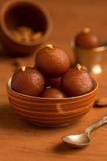
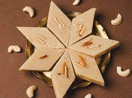

<!DOCTYPE html>
<html lang="en">
<head>
    <meta charset="UTF-8">
    <meta name="viewport" content="width=device-width, initial-scale=1.0">
    <title>CodeHelp da Dhaba</title>
    <link rel="shortcut icon" href="icon.jpeg" type="image/x-icon">
    <link rel="stylesheet" href="work7.css">
</head>

  
<body>
    

        <nav class="navigation">
<ul class="items">
    <li>
Codehelp da Dhabba
</li>
    <li class="item">
        
<a href="#">Home</a>

        
<a href="tel:8708425219">Contact Us</a>

        
<a href="barfi.jpeg">About</a>

    </li>
</ul>
</nav>

<section class="leftbox">
<h1>Gulab Jamun</h1>
 
<h3>Ingredients :</h3>
 
<li>bread</li>
<li>Oil</li>
<li>Milk</li>
<li>Sugar</li> 
<h2>Recipe</h2>
<ol><li>Lorem ipsum dolor sit amet, consectetur adipisicing elit. Animi, labore!</li>
<li>lorem ipsum, dolor sit amet consectetur adipisicing elit.</li>
<li>lorem ipsum dolor sit amet consectetur, adipisicing elit. Dolore, aperiam?</li>
<li>lorem ipsum, dolor sit amet consectetur adipisicing elit. Dignissimos!</li>
</ol>
</section>
<section class="rightbox">

</section>

  
  

<section class="leftbox">
    <h1>Barfi</h1>
     
    <h3>Ingredients :</h3>
     
    <li>Milk</li>
    <li>Ghee</li>
    <li>Sugar</li> 
    <h2>Recipe</h2>
    <ol><li>Lorem ipsum dolor sit amet, consectetur adipisicing elit. Animi, labore!</li>
    <li>lorem ipsum, dolor sit amet consectetur adipisicing elit.</li>
    <li>lorem ipsum dolor sit amet consectetur, adipisicing elit. Dolore, aperiam?</li>
    <li>lorem ipsum, dolor sit amet consectetur adipisicing elit. Dignissimos!</li>
    </ol>
</section>
    <section class="rightbox">
    
    </section>

  
  

<section class="leftbox">
    <h1>Gol Gappe</h1>
     
    <h3>Ingredients :</h3>
     
    <li>Flour</li>
    <li>Oil</li>
    <li>Salt</li>
    <li>Species</li> 
    <h2>Recipe</h2>
    <ol>
        <li>Lorem ipsum dolor sit amet, consectetur adipisicing elit. Animi, labore!</li>
        <li>lorem ipsum, dolor sit amet consectetur adipisicing elit.</li>
        <li>lorem ipsum dolor sit amet consectetur, adipisicing elit. Dolore, aperiam?</li>
        <li>lorem ipsum, dolor sit amet consectetur adipisicing elit. Dignissimos!</li>
    </ol>
</section>
    <section class="rightbox">
    
    </section>

<footer id="footer">
    
 Copyright &#x24B8;CodeHelp da Dhaba Pvt.Ltd 2023 All Rights Reserved 

</footer>
    

</body>
</html>
